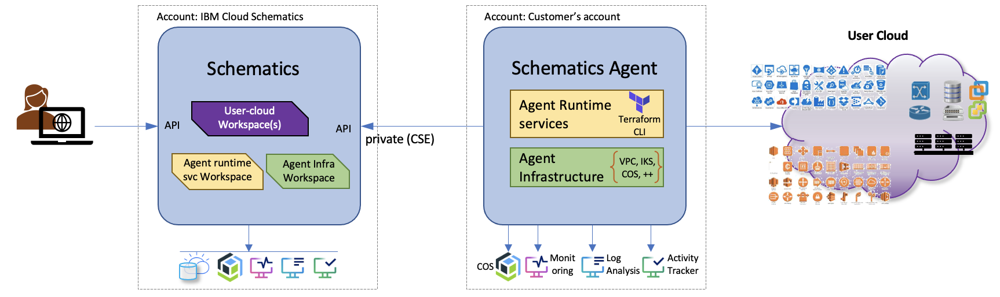

---

copyright:
  years: 2017, 2022
lastupdated: "2022-06-13"

keywords: schematics agent, advantage of agent, agent architecture, importance of agent, agent usage

subcollection: schematics

---

{{site.data.keyword.attribute-definition-list}}

# {{site.data.keyword.bpshort}} agent architecture
{: #agents-architecture}

The {{site.data.keyword.bpshort}} agent feature is currently in beta and should not be used for production workloads.
{: beta}

The following image illustrates the components of {{site.data.keyword.bpshort}} remote agent, and how it works with {{site.data.keyword.bpshort}} in your cloud infrastructure.

{: caption="{{site.data.keyword.bpshort}} remote agents architecture and its components" caption-side="bottom"}

Here are the steps to use the {{site.data.keyword.bpshort}} agent capability in {{site.data.keyword.bpshort}}.

1. You need to set up an {{site.data.keyword.bpshort}} [agent infrastructure workspace](/docs/schematics?topic=schematics-agents-setup) and an [agent runtime workspace](/docs/schematics?topic=schematics-agent-runtime-svc).
2. On your target location, you will register a remote agent with the {{site.data.keyword.bplong_notm}} services through a [private CSE](/docs/schematics?topic=schematics-secure-data#pi-location). To register an agent refer to, [Registering an agent](/docs/schematics?topic=schematics-register-agent). 
3. You can further `deactive`, `edit`, `assign`, or `bind` agent instances to the workspaces for provisioning or unprovisioning.
4. Once the agent is installed, the {{site.data.keyword.bpshort}} runtime jobs and {{site.data.keyword.bpshort}} sandbox jobs are running the your cluster.
5. Now you can enjoy to connect your private data store, expose your secrets which is available only in your cluster, but not in {{site.data.keyword.bpshort}} cluster. You can install any softwares without restrictions from the {{site.data.keyword.bpshort}} cluster.
6. Now in the future, you create the workspace in the infrastructure with the Terraform templates, but `plan`, and `apply` or Terraform execution happens in the {{site.data.keyword.bpshort}} runtime and the sandbox.

## Advantage of using {{site.data.keyword.bpshort}} Agent
{: #usage-agents}

Following are the advantage of using {{site.data.keyword.bpshort}} Agent against the listed components:

| Components | {{site.data.keyword.bpshort}} | {{site.data.keyword.bpshort}} Agent|
| -- | -- | -- |
| `Cluster` | Runs in {{site.data.keyword.bpshort}} cluster. | Runs in customer's cluster. |
| `Cloud providers` | Works primarily with {{site.data.keyword.cloud_notm}} **Note** not tested with other cloud services. | Can integrate with any cloud service providers or private cloud. |
| `Compute time` | Null resources or [(local-exec)](/docs/schematics?topic=schematics-schematics-limitations#local-remote-exec) executes for a maximum of 30 minutes. | There is no compute time restrictions. |
| `Latency` | Runs in {{site.data.keyword.bpshort}} clusters provisioned in `us or eu` region only. | Can be configured to run on edge cluster or {{site.data.keyword.satelliteshort}} cluster for faster response time. |
| `Network configuration` | `Ingress/egress` policies are controlled by {{site.data.keyword.bpshort}}. Cannot reach out to any external PORT that are not in allowed list.| Can decide on `ingress/egress` policies, and can open additional PORTS as required.|
| `Software` | Can use only pre-installed software such as `Python / Jquery / {{site.data.keyword.cloud_notm}} command line` cannot install additional software. | Customer is free to install additional software on need basis. |
| `Tenancy` | Multi tenant. | Single tenant. |
{: caption="Usage of {{site.data.keyword.bpshort}} Agent" caption-side="bottom"}

