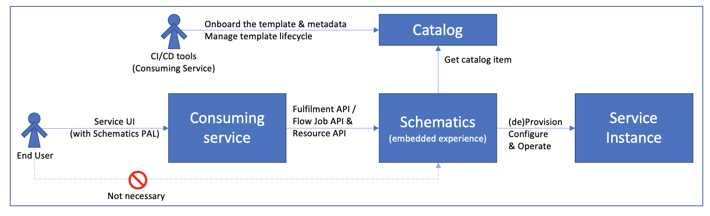

---

copyright:
  years: 2017, 2022
lastupdated: "2022-12-02"

keywords: embedded schematics, embedded, schematics

subcollection: schematics

---

{{site.data.keyword.attribute-definition-list}}

# Embedded {{site.data.keyword.bplong_notm}}
{: #embedded-schematics-intro}

Embedded {{site.data.keyword.bpshort}} proposes developing {{site.data.keyword.bpshort}} as a fulfillment engine or {{site.data.keyword.cloud_notm}} resource broker service. The {{site.data.keyword.cloud_notm}} service can use {{site.data.keyword.bpshort}} as a backend resource broker or as a Pattern and Asset Library (PAL) component to work with a stack of resource. This feature of {{site.data.keyword.bpshort}} is referred as `Embedded {{site.data.keyword.bpshort}}`.
{: shortdesc}

Following are the advantages of using embedded {{site.data.keyword.bpshort}}.
- Using service to service binding with {{site.data.keyword.bpshort}}
- Onboarding few templates to the service-specific catalog.
- Managing the lifecycle of template to create, promote, deprecate, decommission through the CI/CD pipelines services.
- Pre-configuring the input parameters and customizing the console during onboarding.
- Using single-click fulfillment experience to install, uninstall, upgrade, configure, operate, and custom.
- Tracking and viewing the fulfillment process, and service instances.
- Experiencing for in context, but not visible in the {{site.data.keyword.bpshort}} console.
- Analyze, monitor the log services of the template and the service instances.
- Supports Terraform, Helm, `Cloudpak`.
- Supports blueprint through CART API.
- Supports for preview operation.
- Cost Estimation through CART `APIs`.

## Embedded {{site.data.keyword.bpshort}} `APIs`
{: #embedded-schematics-api}

The embedded {{site.data.keyword.bpshort}} displays set of fulfillment `APIs` for consuming services. For more information about the list of fulfillment `APIs`, see [API documentation](/apidocs/schematics/schematics?code=java).
{: shortdesc}

## Comparing {{site.data.keyword.bpshort}} with the embedded {{site.data.keyword.bpshort}}
{: #comparsion}

The table lists the high-level comparison between {{site.data.keyword.bpshort}} and embedded {{site.data.keyword.bpshort}}.

| {{site.data.keyword.bpshort}}  | Embedded {{site.data.keyword.bpshort}} |
|  --- | --- |
| Starts with creation of workspace definition or action definition and {{site.data.keyword.bpshort}} console acts as an entry point from where users run IaC code.| Proposes developing {{site.data.keyword.bpshort}} as a fulfillment engine or {{site.data.keyword.cloud_notm}} resource broker service. The {{site.data.keyword.cloud_notm}} service can use {{site.data.keyword.bpshort}} as a backend resource broker or as a PAL component to work with a stack of resource. |
| Default consumption patterns are used by other {{site.data.keyword.cloud_notm}} services to work with a stack of {{site.data.keyword.cloud_notm}} resources by using IaC. It includes provisioning or deprovisioning a stack, configuring the stack, and sets the lifecycle operations on the stack of resource. | Uses services such as {{site.data.keyword.satellitelong}} location or {{site.data.keyword.codeenginefull}} to provision a stack of {{site.data.keyword.cloud_notm}} resources by using {{site.data.keyword.bpshort}} Workspace, and to operate on the stack of resources by using {{site.data.keyword.bpshort}} action. |
| You work with the stack {{site.data.keyword.bpshort}} resources from your {{site.data.keyword.bpshort}} service, such as {{site.data.keyword.satellitelong_notm}} location or {{site.data.keyword.codeenginefull}}, by using a single page, or single click experience without having the knowledge about {{site.data.keyword.bpshort}}. | The service points to a template in the {{site.data.keyword.cloud_notm}} public or private catalog such as Terraform, Helm, or Ansible to initiate the fulfillment job. Further, queries for the status to fetch the details about the job by using fulfillment `APIs`. |
{: caption="{{site.data.keyword.bpshort}} Verses embedded {{site.data.keyword.bpshort}}" caption-side="top"}

## Design flow 
{: #embedded-schematics-design}

The image shows the design flow of the embedded {{site.data.keyword.bplong_notm}} consuming services.

{: caption="Embedded {{site.data.keyword.bplong_notm}} consuming service flow" caption-side="bottom"}

1. The embedded {{site.data.keyword.bplong_notm}} `CART API` binds an object between consuming service and {{site.data.keyword.bplong_notm}}. The service saves `CART ID` that are generated and returned by {{site.data.keyword.bplong_notm}} and use for fetching the status of the job request, job logs, updating input values, or destroying resources.
2. The `CART API` request payload contains the {{site.data.keyword.cloud_notm}} catalog and offering details. Also, you can save up front with {{site.data.keyword.bplong_notm}} by using configuration files if

    - {{site.data.keyword.cloud_notm}} catalog and offering details are passed through `CART APIs`.
    - request payload doesn’t contains {{site.data.keyword.cloud_notm}} catalog, and offering details, then fetches from service registration details.
    - offering ID and version are passed by the {{site.data.keyword.cloud_notm}} catalog ID associated with the service are fetched from registration details by assuming that the service saves in {{site.data.keyword.bpshort}}.

3. The `CART API` request payload includes the credentials to access the {{site.data.keyword.cloud_notm}} catalog.
4. The `CART API` request payload includes the credentials to access the GitHub repository.
5. The {{site.data.keyword.cloud_notm}} user by using consuming service need not have the knowledge of the embedded {{site.data.keyword.bpshort}} experience.

## Enhancements
{: #embedded-schematics-enhancement}

The enhancements of the embedded {{site.data.keyword.bplong_notm}} are:
- Incrementally provide list of resources that are provisioned instead of providing list of resources at the end of the apply action.
- {{site.data.keyword.cloud_notm}} catalog or repository contains configuration file to provide information about list of resources that are provisioned by the consuming service that are similar format to the state file.
- Provide API to read this configuration file and return the resources list that is having similar payload as resources API.
- Create registration `APIs` to set the service name, catalog, credentials, offering details, and update service details.

